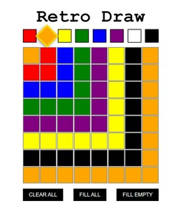
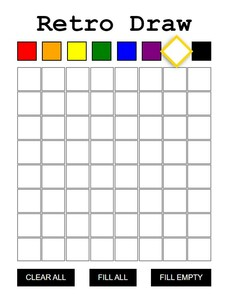

# Retro Game.

## Description.

Retro Game is a App from Fullstack Academy which is given to the students in order to practice react library. I completed all the code successfully and also it is fully functional. This app allows you to save your last drawing on the local storage of your browser. This App has 8 different colors to choose from. As a user, you can choose if you want to color the cells one by one, all cells in one click, or color the only the cells that have no color on them.

## Enjoy it!

_this project was finished by_ **Yeisson Giraldo**
